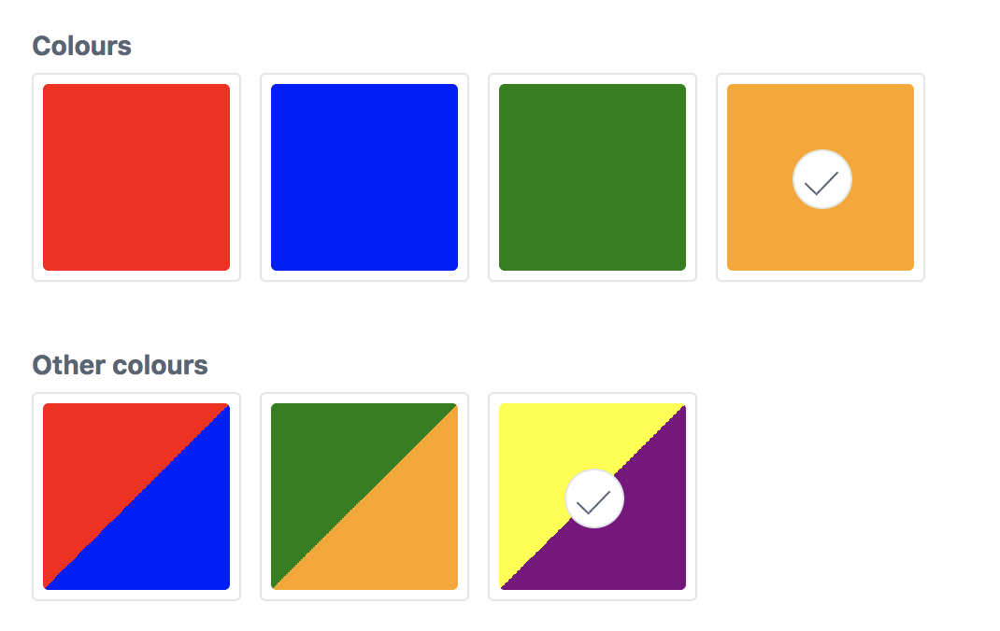
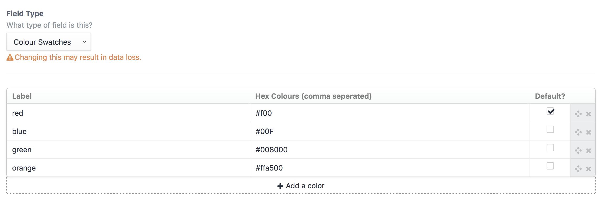
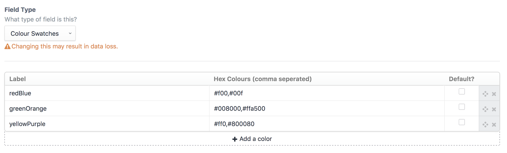
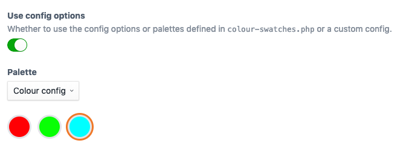

[](https://github.com/rias500/craft-color-swatches/releases)
[](https://scrutinizer-ci.com/g/rias500/craft-color-swatches)
[](https://styleci.io/repos/117454863)
[](https://packagist.org/packages/rias/craft-color-swatches)

# Color Swatches plugin for Craft CMS 3.x

Let clients choose from a predefined set of colors.



## Support Open Source. Buy beer.

This plugin is licensed under a MIT license, which means that it's completely free open source software, and you can use it for whatever and however you wish. If you're using it and want to support the development, buy me a beer over at Beerpay!

[](https://beerpay.io/Rias500/craft-color-swatches)

## Requirements

This plugin requires Craft CMS 3.0.0-beta.23 or later.

## Installation

To install the plugin, follow these instructions.

1. Open your terminal and go to your Craft project:

        cd /path/to/project

2. Then tell Composer to load the plugin:

        composer require rias/craft-color-swatches

3. In the Control Panel, go to Settings → Plugins and click the “Install” button for Color Swatches.

## Color Swatches Overview

Instead of providing a user a full color picker, Color Swatches gives an admin the ability to provide a selection of colors for a user to choose from.

## Configuring Color Swatches

Create a Color Swatches field and provide label and hex value options.



Multiple colors are possible by seperating them with a comma



## Using the config file

You can create a `config/color-swatches.php` file to predefine the possible colors or define different palettes.
Take a look at the [config file](https://github.com/Rias500/craft-color-swatches/blob/master/src/config.php) in this repo for an example.

```php
return [

    // Predefined colors
    'colors' => [
        [
            'label' => 'red',
            'color' => '#ff0000',
            'default' => false,
        ],
        [
            'label' => 'green',
            'color' => '#00ff00',
            'default' => false,
        ],
        [
            'label' => 'blue',
            'color' => '#0000ff',
            'default' => false,
        ],
        [
            'label' => 'pink',
            'color' => '#ff00ff',
            'default' => false,
        ]
    ],

    'palettes' => [
        'Red Green' => [
            [
                'label'   => 'red',
                'color'   => '#ff0000',
                'default' => false,
            ],
            [
                'label'   => 'green',
                'color'   => '#00ff00',
                'default' => false,
            ],
        ],
        'Buttons' => [
            [
                'label'   => 'blue-white',
                'color'   => '#0000ff,#ffffff',
                'default' => false,
            ],
            [
                'label'   => 'red-white',
                'color'   => '#ff0000, #ffffff',
                'default' => false,
            ],
        ],
    ],
];
```

In your field settings you can then have the possibility to have it use the predefined colors.



## Using Color Swatches

You can access both the label and color in your template. By default, the label will display:

```twig
{{ fieldName }}
{{ fieldName.label }}
{{ fieldName.labels }} {# Returns an array of all labels #}
{{ fieldName.color }}
{{ fieldName.colors }} {# Returns an array of all colors #}
```

Based on the awesome [Craft 2 plugin](https://github.com/vigetlabs/craft-color-swatches) from Vigetlabs

Brought to you by [Rias](https://rias.be)
